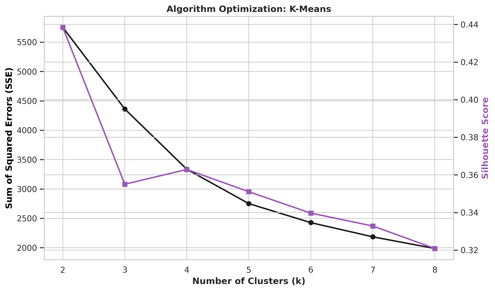
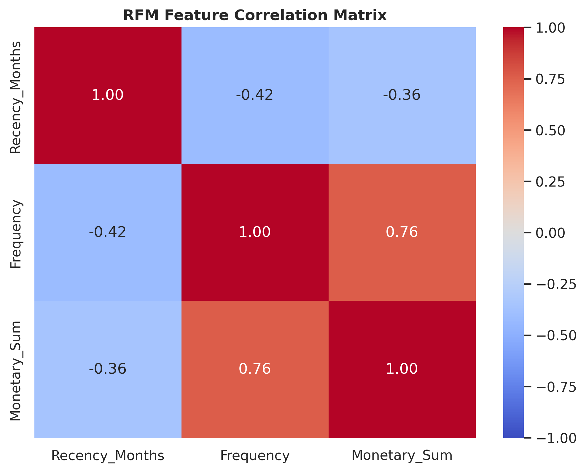
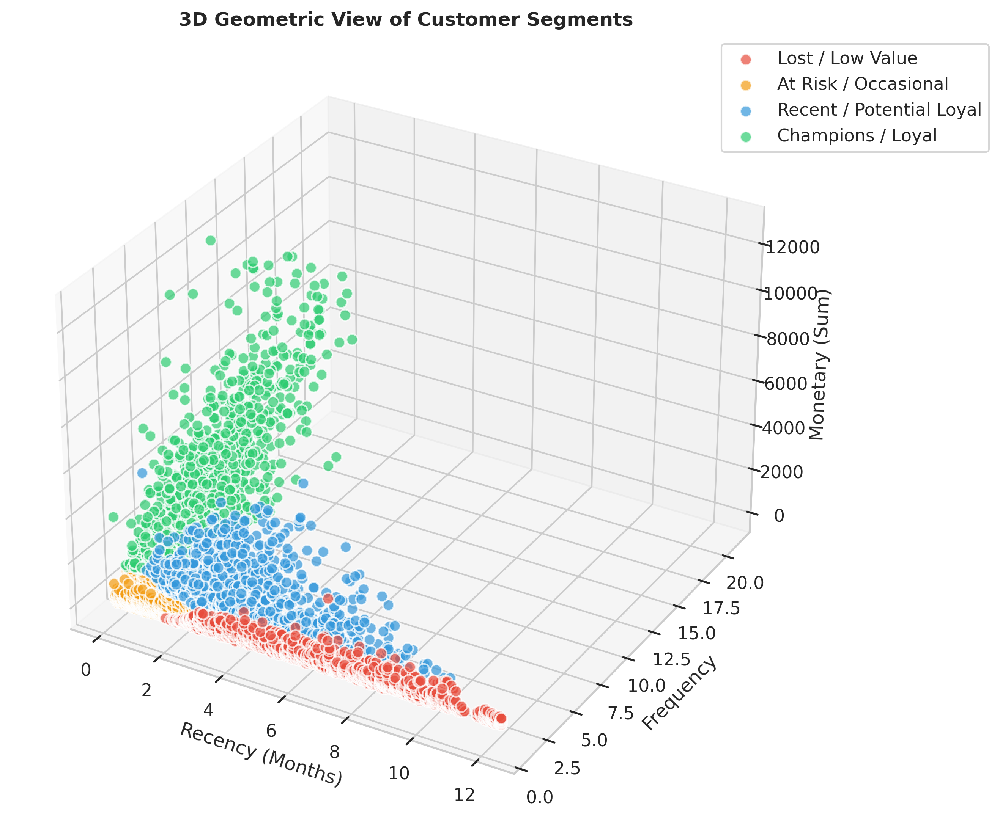
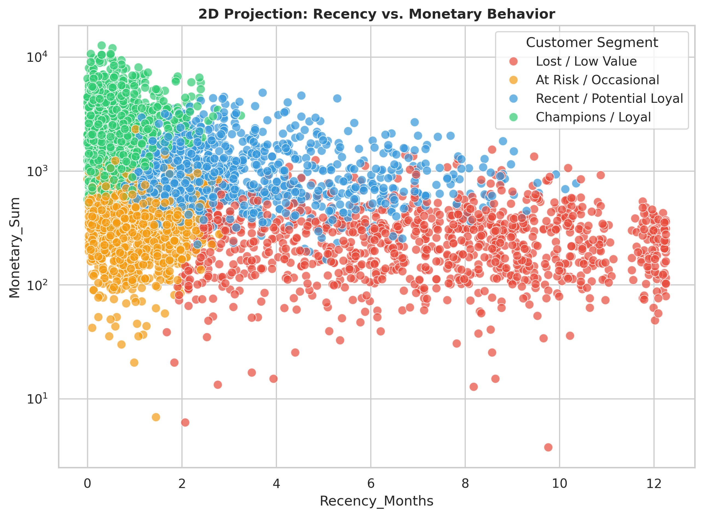
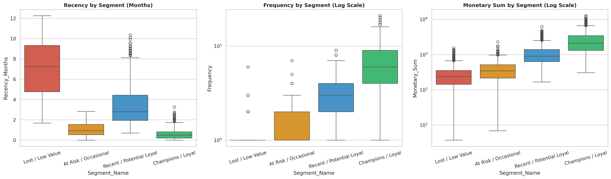
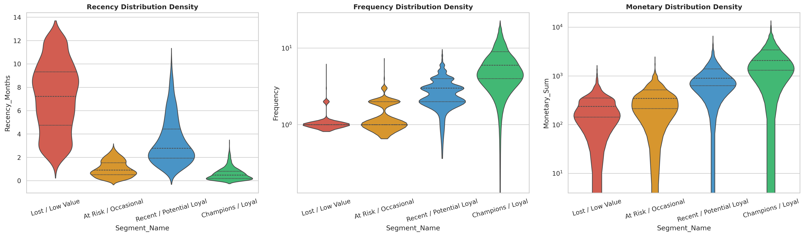
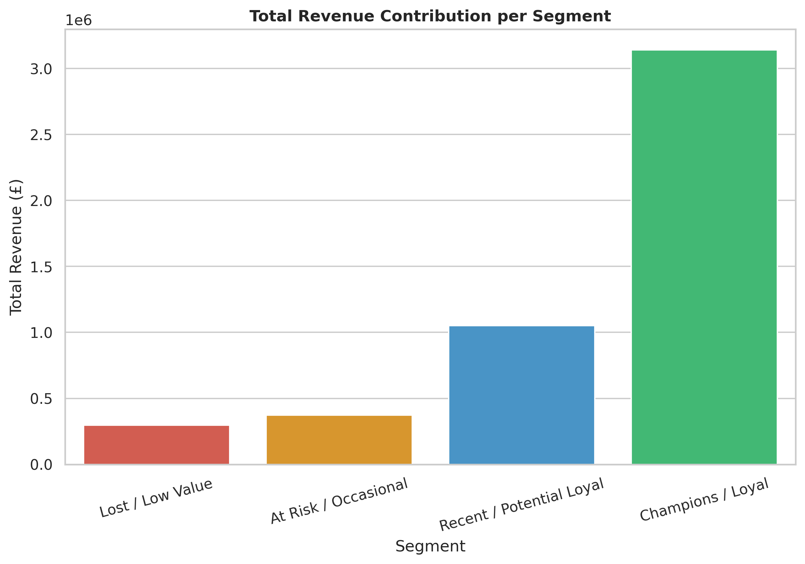
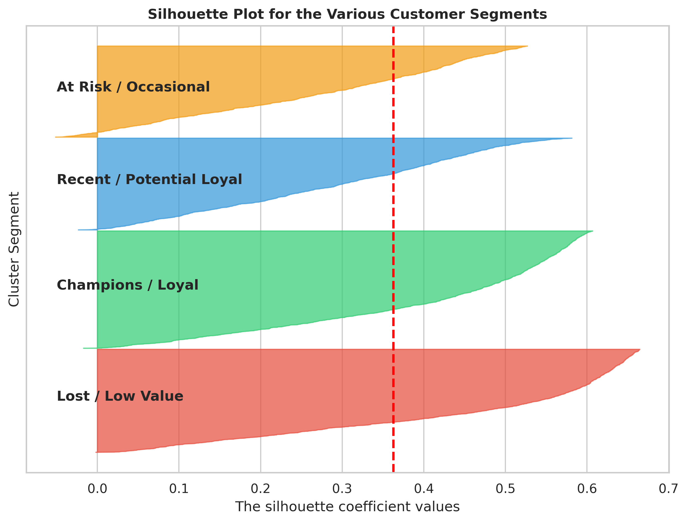

<div align="center">
  
  
  
  
  
  
  
</div>

<br/>

# Advanced Customer Segmentation Framework (DAC3)

## 📌 Project Overview
This project performs advanced customer segmentation on an online retail dataset using **RFM (Recency, Frequency, Monetary)** analysis combined with robust unsupervised machine learning techniques. Its primary goal is to group vast customer arrays into distinct, easily actionable business segments (e.g., *Lost/Low Value*, *At Risk*, *Potential Loyal*, and *Champions*), enabling targeted marketing efforts and smart resource allocation.

The entire architecture is cloud-native: it is designed to be fully executed within **Google Colab**, securely pulling raw data from and outputting predictive model artifacts directly to **Google Drive**.

---

## ☁️ Setting Up (Colab + Google Drive)
This pipeline leverages the free integrated ecosystems provided by Google Cloud.
- **Environment:** Run the data modeling natively in Google Colab using `DAC3.ipynb`.
- **Data Input:** Raw data (`Online Retail.xlsx`) is stored securely in your connected Google Drive path (`/MyDrive/DAC3/Data/`).
- **Data Output:** All cleaned data subsets, robust visual charts, calculation metrics, and persistent `.pkl` machine learning models are systematically logged directly to your Drive's `Output/` directory.

### Quick Start Instructions
When initializing the notebook inside Colab, execute the mount cell to seamlessly grant directory read/write privileges:
```python
from google.colab import drive
drive.mount('/content/drive')
```

---

## 🛠️ Models & Analytics Pipeline Used
The analytics software is built as a complete end-to-end data processing and machine learning pipeline. Each layer in the architecture resolves specific statistical, computational, or geometric complexities to deliver highly precise customer categorizations. 

### 1. Data Cleaning & Instantiation
- First, the raw `Online Retail.xlsx` document is loaded. The data immediately goes through a rigorous pre-processing phase where missing `CustomerID`s and cancelled orders (denoted by an invoice starting with 'C') are pruned. 
- Records featuring illogical negative or zero-quantities are additionally dropped to ensure pure positive value extraction when calculating geometric distances. 

### 2. RFM Feature Engineering
Translating raw invoices into quantifiable behavioral features is the bedrock of the algorithm:
- Uses modern **Pandas "Named Aggregation"** to construct a flat, clean dataframe out of grouped transactional states natively instead of dealing with computationally heavy loop iterators. 
- An important mathematical mitigation takes place during the *Recency* calculation: The maximum `study_date` is offset by a single day deliberately. This padding is enforced proactively to mathematically prevent buyers who purchased on the absolute last day of study from generating a Recency = 0, which would critically break algorithms down the line due to mathematical `log(0)` invalidation.

### 3. Outlier Isolation & Extraction (Anomaly Detection)
Unsupervised clustering is highly susceptible to distortion caused by massive spending vectors (e.g., enterprise distributors hiding among individual consumers). 
- We deploy an **Isolation Forest Algorithm** utilizing a `5% contamination boundary`. 
- Isolation forests isolate observations by randomly selecting a feature and then randomly splitting its bounds. Because anomalies are "few and different," they are mathematically isolated closer to the root of the tree and subsequently pruned, securing the bounds of the clustering logic to the 95% majority without heavy distortion skew.

### 4. Mathematical Normalization
RFM vectors naturally present with intense positive skew (very high frequency or massive spend amounts by a few people vs standard low values for most). Because spatial clustering evaluates straight geometric distance, variables must be mapped to congruent distributions. 
- Instead of using a standard log transform or Min/Max scaler, the environment deploys the **Yeo-Johnson PowerTransformer**.
- Yeo-Johnson strictly standardizes both strictly positive continuous data and variable zero-ranges into normal, Gaussian-like distributions autonomously—zero-meaning and standardizing the unit variance all within a single processing command constraint.

### 5. Centroid Clustering Calculation (K-Means)
The engine executes core structural customer partitioning utilizing **K-Means Clustering** to separate multidimensional space into distinct voronoi cells. 
- An operational parameter $k=4$ was finalized by simultaneously calculating internal evaluations utilizing varying $k$ bounds. By plotting multi-dimensional ranges, we trace overlapping dynamics between **Elbow Sum of Squared Errors (SSE)** dropoffs and maximizing localized peaks within **Silhouette scoring** bounds. 

### 6. Dynamic Centroid Sorting Algorithm
Algorithms return numbers, not business intelligence. In generic setups, "Cluster 0" may be assigned to "Loyal Champions" today, but when ran tomorrow on new data "Cluster 0" might become "Lost Shoppers"—breaking frontend dashboards dependent on fixed mappings. 
- This framework deploys a **Dynamic Centroid Sorting Algorithm** that identifies the exact mathematical monetary sum centroid center for every returned array. 
- Clusters are re-ordered dynamically from lowest monetary mean to highest before textual label mapping takes place, preserving the integrity of classifications regardless of dimensional shifts taking place month-over-month.

---

## 📊 Business Intelligence & Post-Clustering Metrics
Analyzing the resulting classifications displays exactly how revenue impacts specific business domains (automatically saved to `Output/Metrics/`).

| Segment | Customer Count | Market Share | Total Revenue (£) | Revenue Share | Avg Customer LTV | Median Recency (Months) | Median Frequency | Median Monetary (£)|
| --- | :---: | :---: | :---: | :---: | :---: | :---: | :---: | :---: |
| **Champions / Loyal** | 1,199 | 29.09% | 3,142,192.80 | 64.61% | £2,620.68 | 0.49 | 6.0 | £2,085.08 |
| **Recent / Potential Loyal** | 938 | 22.76% | 1,051,827.90 | 21.63% | £1,121.35 | 2.79 | 3.0 | £898.69 |
| **At Risk / Occasional** | 931 | 22.59% | 372,380.14 | 7.66% | £399.98 | 0.92 | 1.0 | £346.12 |
| **Lost / Low Value** | 1,053 | 25.55% | 296,567.96 | 6.10% | £281.64 | 7.23 | 1.0 | £237.61 |

---

## 🧪 Unsupervised ML Evaluation Metrics
Evaluating the fundamental internal strength of the proposed $k=4$ geometric structures. 

| Evaluation Metric | Model Output Index | Model Interpretation |
| --- | :---: | --- |
| **Silhouette Score** | `0.3629` | Higher is better (Closer to 1 establishes tightly bounded cluster domains) |
| **Davies-Bouldin Index** | `0.9818` | Lower is better (Evaluates the average similarity measure of each cluster) |
| **Calinski-Harabasz Index**| `3713.38` | Higher is better (Represents well-defined densely packed groupings) |

---

## 📈 Key Visual Insights
*(Project dynamically produces and archives full-resolution transparent views directly inside `Output/Charts/`)*

<div align="center">
  <h3>Algorithmic Architecture Optimization</h3>
  
  
  <br/>
  <h3>Spatial Geometry Clustering Visualization</h3>
  
  
  <br/>
  <h3>Distribution Analysis Analytics</h3>
  
  
  <br/>
  <h3>Internal Cluster Fidelity Evaluation</h3>
  
  
</div>
